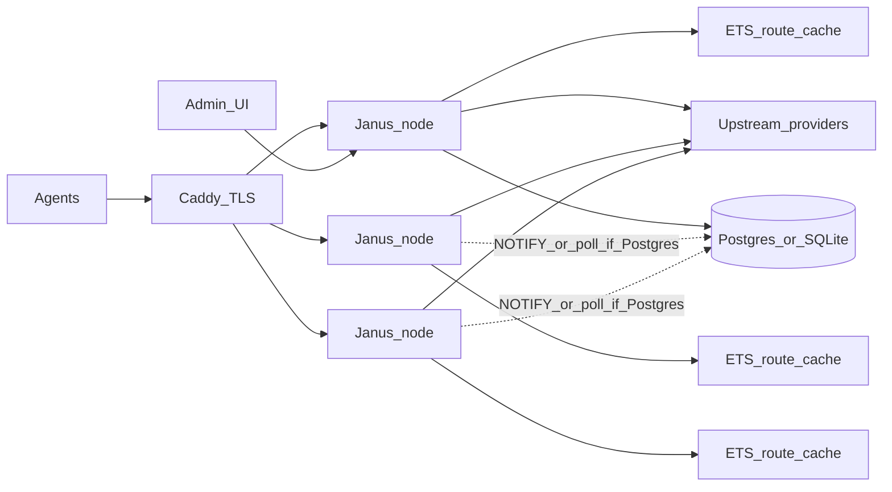

# Janus — Erlang LLM gateway

## Name

**Janus** — doorway / two faces: OpenAI and Anthropic on both the agent side and the upstream side.

Repo: `F:/Janus` locally; public GitHub `huangcheng/janus` when published.

## Goals (v1)

- **Web UI** to maintain providers, API keys (per channel), models, and routing.
- **Agent-facing APIs**: OpenAI `POST /v1/chat/completions`, OpenAI `POST /v1/responses`, Anthropic `POST /v1/messages` (plus `GET /v1/models`).
- **Upstream adapters** for those same three shapes (OpenAI-chat, OpenAI-responses, Anthropic-messages), with translation when agent protocol ≠ upstream protocol.
- **Native cluster LB** in OTP (channel weight / round-robin / key pool).

Non-goals for v1: billing, multi-tenant orgs, image/audio/embeddings (add later).

## Fault tolerance with shared catalog DB

**Configurable backend (Docker-friendly):**

- If Postgres env is present (`JANUS_DB_URL` or `JANUS_DB_HOST` + user/password/name), use **shared Postgres** (multi-node; `LISTEN/NOTIFY` for reload).
- If those env vars are **absent**, fall back to **local SQLite** (`JANUS_SQLITE_PATH`, default `/var/lib/janus/janus.db` in containers / `./data/janus.db` locally). Single-node / laptop / `docker run` without a DB sidecar.
- Same schema migrations applied through a thin `janus_db` adapter (`postgres` | `sqlite`).
- Multi-node production: set Postgres env on all nodes (one shared DB). Do not run multiple nodes against separate SQLite files.

The DB is the system of record for **admin config**, not the request datapath:

**Rules:**

1. **Hot path = ETS only** — resolve model → channels → keys → LB pick from memory; stream proxy never queries SQL.
2. **Config reload** — on boot load full snapshot into ETS; on admin write, commit DB then notify/poll; all nodes refresh ETS (Postgres: `NOTIFY`; SQLite: local reload only).
3. **DB down, traffic up** — if DB is unreachable, refuse admin mutations; keep serving with last good ETS (and optional on-disk snapshot for cold start).
4. **Postgres HA is ops** — managed Multi-AZ / Patroni when you care; Janus does not invent multi-master config.
5. **LB state in Erlang** — cool-downs, in-flight counts, round-robin cursors live in `gen_server`/ETS on each node; Caddy stays TLS + coarse node spread.

## Architecture

| Layer    | Choice                                                                                                                  |
| -------- | ----------------------------------------------------------------------------------------------------------------------- |
| Runtime  | Erlang/OTP 27+, rebar3 release                                                                                          |
| HTTP     | Cowboy (HTTP/1.1 + SSE/chunked streaming)                                                                               |
| JSON     | jsx or thoas                                                                                                            |
| DB       | **Configurable**: Postgres (`epgsql`) when env set; else SQLite (`esqlite`). Shared migrations via `janus_db` adapter.  |
| Admin UI | Static SPA (Vite + React or Vue) served by Cowboy under `/admin`; talks to `/admin/api/*`                               |
| Auth     | Agent: bearer API keys in DB; Admin: separate admin token/password (session cookie or bearer)                           |
| Cluster  | Distributed Erlang optional; **config correctness** from shared Postgres + NOTIFY when clustered; SQLite = single node  |

### Core OTP apps

- `janus_core` — config store, ETS cache, LB, cool-down
- `janus_http` — Cowboy routes, SSE, protocol codecs
- `janus_providers` — upstream clients (openai_chat, openai_responses, anthropic_messages)
- `janus_admin` — admin REST + static UI assets

### Data model

Same logical tables on Postgres or SQLite:

- `api_keys` — agent tokens, enabled, rate limits
- `providers` — name, base_url, protocol (`openai_chat` | `openai_responses` | `anthropic_messages`), auth headers/secrets, weight, enabled, cooldown_ms
- `provider_keys` — multiple secrets per provider (key-level RR)
- `models` — public model id, enabled
- `model_routes` — model_id → provider_id, optional weight override, enabled
- `admin_users` / settings — minimal

Secrets encrypted at rest with a node env key (`JANUS_SECRETS_KEY`), not plaintext in UI responses.

### Request flow

1. Authenticate agent key.
2. Parse body by path (chat / responses / messages).
3. Map requested model → route set from ETS.
4. LB pick: skip cooled channels; weighted / RR; key RR inside provider.
5. Translate request to upstream protocol if needed.
6. Stream upstream → translate stream events → client; on failure, cool channel and retry next.

### Protocol matrix (v1)

| Agent \ Upstream | openai_chat           | openai_responses | anthropic_messages |
| ---------------- | --------------------- | ---------------- | ------------------ |
| chat/completions | passthrough/normalize | translate        | translate          |
| responses        | translate             | passthrough      | translate          |
| messages         | translate             | translate        | passthrough        |

Start with **same-protocol passthrough + the highest-value translations** (Anthropic↔OpenAI chat streaming/tools), then expand Responses coverage.

## Web UI (v1 screens)

- Providers: CRUD, protocol, base URL, keys, weight, enable/cool status (read-only live)
- Models: CRUD public ids, attach routes to providers
- API keys: create/revoke agent keys
- Health: node list, ETS generation, last config sync, optional upstream probe

No usage billing graphs in v1 (optional request counter later).

## Implementation phases

1. **Skeleton** — rebar3 umbrella, Cowboy hello, DB migrations, ETS config loader + NOTIFY.
2. **Passthrough** — OpenAI chat + Anthropic messages same-protocol proxy + streaming + basic LB/retry/cool-down.
3. **Admin API + UI** — providers/models/keys CRUD; live reload.
4. **Cross-protocol** — chat↔messages translation (stream + tools minimal).
5. **Responses** — `/v1/responses` endpoint + upstream adapter.
6. **Hardening** — rate limit, disk/memory guards, release/deploy compose, smoke tests.

## Success criteria

- Claude Code / pi / OpenCode can point at Janus with OpenAI or Anthropic base URLs and complete a tool-calling streamed turn.
- Three Janus nodes share one Postgres; editing a provider in the UI appears on all nodes without file sync.
- Stopping Postgres after warm cache does **not** break new chat requests (admin writes fail closed).
