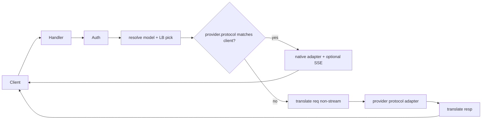

# Multi-protocol gateway (chat + responses + messages)

## Decisions (locked)

- **Routing:** prefer native protocol when `provider.protocol` matches the client API; otherwise translate.
- **Streaming:** native SSE passthrough when protocols match; translate path is **non-stream only** (`stream: true` → 400 with a clear code).
- **Tools (translate):** basic OpenAI `tools`/`tool_calls` ↔ Anthropic `tools`/`tool_use`/`tool_result` for common shapes; exotic Responses item types → 400.
- **Auth:** keep Bearer agent keys; on `/v1/messages` also accept Anthropic-style `x-api-key` as the agent key (same catalog verify path).

## Current baseline

- Routes stubbed in [`apps/janus_http/src/janus_http_sup.erl`](apps/janus_http/src/janus_http_sup.erl): `/v1/responses` and `/v1/messages` → 501.
- Hot path is [`janus_http_chat`](apps/janus_http/src/janus_http_chat.erl) → always [`janus_providers_openai:chat_completions/3`](apps/janus_providers/src/janus_providers_openai.erl) with `stream => false` and path `/chat/completions`.
- Provider `protocol` is stored/catalogued but **not consulted** on the proxy path.

## Architecture

### Shared proxy core

Extract orchestration from `janus_http_chat` into something like `janus_http_proxy` (or keep chat thin and share helpers):

- auth, body read/JSON decode, model allowlist, `janus_auto:maybe_route/2`, `janus_lb:pick_route/2`, cooldown/failure noting, header filtering, error shapes.
- New entrypoints: `proxy(ClientProto, Body, Map, Req, State)` where `ClientProto` is `openai_chat | openai_responses | anthropic_messages`.

Handlers:

- Keep/extend [`janus_http_chat`](apps/janus_http/src/janus_http_chat.erl) for `/v1/chat/completions`.
- Add `janus_http_responses` for `/v1/responses`.
- Add `janus_http_messages` for `/v1/messages` (auth: Bearer **or** `x-api-key`).
- Wire routes in [`janus_http_sup`](apps/janus_http/src/janus_http_sup.erl); delete 501 stubs for those paths.

### Upstream adapters (`janus_providers`)

- **Refactor** [`janus_providers_openai`](apps/janus_providers/src/janus_providers_openai.erl):
  - shared gun POST (and streaming POST) helper.
  - `chat_completions/3` path `/chat/completions`.
  - `responses/3` path `/responses`.
  - Respect client `stream` only on native path; stop forcing `stream => false` for passthrough.
- **Add** `janus_providers_anthropic.erl`:
  - POST `{base}/messages` with `x-api-key` + `anthropic-version` (default `2023-06-01`, overridable via env if already present elsewhere).
  - Non-stream + stream passthrough (SSE).

Dispatch by `maps:get(protocol, Provider)` from catalog lookup (already on provider rows).

### Translation module

Add `janus_protocol_translate` (in `janus_http` or `janus_core`; prefer `janus_http` to keep core catalog-only):

Supported non-stream pairs for v1:

| Client → Provider | Translate |
|---|---|
| chat ↔ messages | yes (text + basic tools) |
| chat ↔ responses | yes (messages↔input/output items, basic tools) |
| messages ↔ responses | via chat as pivot **or** direct; implement as chat-pivot to minimize matrices |

Out of scope v1: streaming translation, computer-use, file/image nuance beyond simple text/image_url passthrough if already present in body, Responses background/store modes.

On unsupported features: return **400** with `code` like `translate_unsupported` (not silent drop).

### Streaming (native only)

- When `ClientProto == ProviderProto` and `stream == true`: gun stream → Cowboy chunked/`text/event-stream` reply; reuse cooldown rules on terminal status.
- When translating and `stream == true`: **400** `stream_requires_native_protocol`.

### Auto-router

Reuse `janus_auto:maybe_route/2` for all three handlers when model is `janus-auto` (or existing virtual name). Auto path remains chat-shaped internally if needed; if client is messages/responses, translate after tier pick into the chosen provider’s protocol.

### Tests / verification

Repo has no Common Test suite today — add focused unit tests for translate (pure functions) under `apps/janus_http/test/` or `apps/janus_core/test/` with `eunit`, covering:

- chat→messages / messages→chat text + one tool round-trip
- chat→responses / responses→chat basic
- stream=true on translate → error atom/code
- protocol dispatch picks anthropic vs openai paths (mockable resolve)

Manual: hit Aliyun `/v1/messages` and `/v1/responses` after deploy against an `openai_chat` provider (translate) and document expected non-stream behavior.

## Files likely touched

- [`apps/janus_http/src/janus_http_sup.erl`](apps/janus_http/src/janus_http_sup.erl)
- [`apps/janus_http/src/janus_http_chat.erl`](apps/janus_http/src/janus_http_chat.erl) (refactor to shared proxy)
- new: `janus_http_responses.erl`, `janus_http_messages.erl`, `janus_http_proxy.erl`, `janus_protocol_translate.erl`
- [`apps/janus_http/src/janus_http_auth.erl`](apps/janus_http/src/janus_http_auth.erl) (`x-api-key`)
- [`apps/janus_providers/src/janus_providers_openai.erl`](apps/janus_providers/src/janus_providers_openai.erl) + new anthropic module + app/src layout
- [`README.md`](README.md) — mark responses/messages as implemented with translate caveats

## Out of scope

- Cross-protocol streaming translation
- Full Responses API surface (background, MCP, code interpreter, etc.)
- Changing seed protocols (domestic verticals stay `openai_chat`; clients may still use Messages/Responses via translate)
